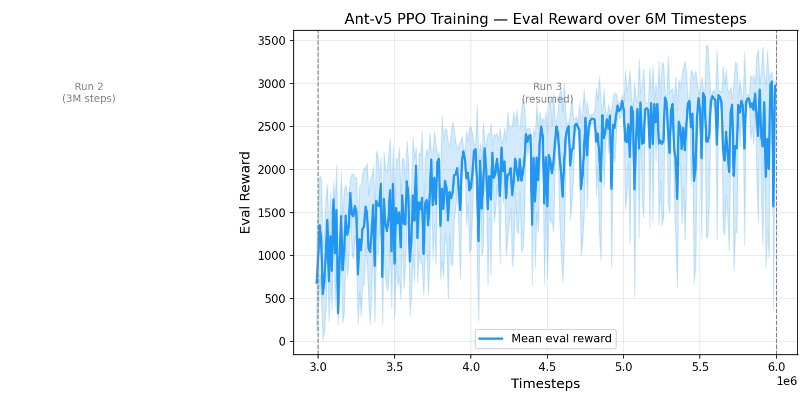

# Ant Locomotion RL — Sim-to-Real Portfolio Project

A sim-to-real reinforcement learning project training a MuJoCo Ant agent to walk using **PPO** (Proximal Policy Optimization) via Stable-Baselines3. The goal is a locomotion controller trained entirely in simulation that transfers to physical hardware with minimal adaptation.

---

## Demo


---

## Training Curve (Runs 2 + 3)



---

## Training Story

Training ran in three rounds totalling **6M+ timesteps**. Each round taught a different lesson.

### Run 1 — Baseline (1M steps)

| Setting | Value |
|---|---|
| `n_steps` | 2048 |
| `batch_size` | 64 |
| `ent_coef` | 0 |
| `target_kl` | None |

Best eval reward: **~1,012** at 30k steps. The agent learned to survive but reward collapsed after ~80k steps and never recovered, oscillating between 40–300 for the remaining 920k steps. Root cause: low entropy led to premature convergence, and with no `target_kl` guard, large policy updates destabilised the value function.

---

### Run 2 — Hyperparameter Fix (3M steps, fresh)

Deleted logs and checkpoints. Applied targeted fixes:

| Change | Old → New | Reason |
|---|---|---|
| `n_steps` | 2048 → **4096** | More data per update stabilises value estimates |
| `batch_size` | 64 → **256** | Larger minibatches reduce gradient noise |
| `ent_coef` | 0 → **0.01** | Entropy bonus prevents collapse into local optima |
| `target_kl` | None → **0.02** | Early-stops update epochs if KL diverges, prevents policy collapse |

Best eval reward: **~1,440**. The `target_kl` guard fired regularly (keeping updates conservative), and the policy avoided the mid-training collapse seen in Run 1. Still below the ceiling achievable with longer training.

---

### Run 3 — Resumed from Best Checkpoint (3M more steps)

Loaded `best_model/best_model.zip` and its `vec_normalize.pkl` directly, continuing with `reset_num_timesteps=False` so the TensorBoard x-axis was preserved. No hyperparameter changes.

Best eval reward: **~3,024** at step 5.97M — full 1,000-step episodes sustained. More than **2× the Run 2 peak**, suggesting the policy had not yet plateaued and simply needed more wall-clock training on a stable trajectory.

**Key insight**: resuming preserves the running observation normalisation statistics accumulated by `VecNormalize`. Starting fresh would reset those stats, effectively presenting a different observation distribution to the same policy weights — a silent source of instability.

---

## Environment

| Property | Detail |
|---|---|
| Task | `Ant-v5` (Gymnasium + MuJoCo) |
| Observation | 27-dim proprioceptive (joint pos, vel, contact forces) |
| Action | 8-dim continuous joint torques |
| Reward | Forward velocity + survival bonus − control cost − contact cost |

---

## Algorithm — PPO Hyperparameters (Runs 2 & 3)

| Hyperparameter | Value |
|---|---|
| Learning rate | 3e-4 |
| `n_steps` (rollout length) | 4096 |
| `batch_size` | 256 |
| Epochs per update | 10 |
| Discount γ | 0.99 |
| GAE λ | 0.95 |
| Clip range | 0.2 |
| `ent_coef` | 0.01 |
| `target_kl` | 0.02 |
| Parallel envs | 4 |

---

## Setup

```bash
git clone https://github.com/shivani46/ant-locomotion-rl
cd ant-locomotion-rl

python -m venv venv
# Windows
venv\Scripts\activate
# Linux / macOS
source venv/bin/activate

pip install -r requirements.txt
```

> MuJoCo 2.x is bundled with `gymnasium[mujoco]` — no separate installation needed.

---

## Train

```bash
python train.py
```

- Automatically **resumes** from `best_model/best_model.zip` if it exists, otherwise starts fresh.
- Saves the best checkpoint to `best_model/best_model.zip` whenever eval reward improves.
- Saves `vec_normalize.pkl` on completion.
- Periodic checkpoints every 50k steps in `checkpoints/`.

### Monitor with TensorBoard

```bash
tensorboard --logdir logs
# open http://localhost:6006
```

---

## Evaluate

```bash
python evaluate.py
```

Opens the MuJoCo viewer and runs 5 deterministic episodes.

---

## Record Video

```bash
python record_video.py
```

Records 3 episodes to `videos/ant_walking.mp4` and merges them into a single file using ffmpeg.

---

## Project Structure

```
ant-locomotion-rl/
├── train.py            # PPO training — supports fresh start and resume
├── evaluate.py         # Render policy in MuJoCo viewer
├── record_video.py     # Save episodes to videos/ant_walking.mp4
├── requirements.txt
├── README.md
├── assets/
│   └── training_curve.png   # Eval reward over 6M timesteps (Runs 2 + 3)
├── best_model/
│   ├── best_model.zip        # Best policy (reward ~3024)
│   └── vec_normalize.pkl     # Observation normalisation statistics
├── videos/
│   ├── ant_walking.mp4       # Recorded episodes (generated)
│   └── ant_walking.gif       # 640px-wide gif for README (generated)
├── logs/                     # TensorBoard event files (generated)
└── checkpoints/              # Periodic model saves (generated)
```

---

## Sim-to-Real Transfer Notes

- **Proprioceptive-only observations** mirror real IMU and encoder readings — no privileged simulator state.
- **`VecNormalize` statistics** (`vec_normalize.pkl`) must be applied identically on the robot inference loop.
- **Domain randomisation** (joint friction, link mass, motor noise) can be layered in via Gymnasium wrappers to improve transfer robustness before hardware deployment.
- The `target_kl` guard produces conservative, smooth policy updates — important for hardware safety where sudden torque changes can damage joints.
